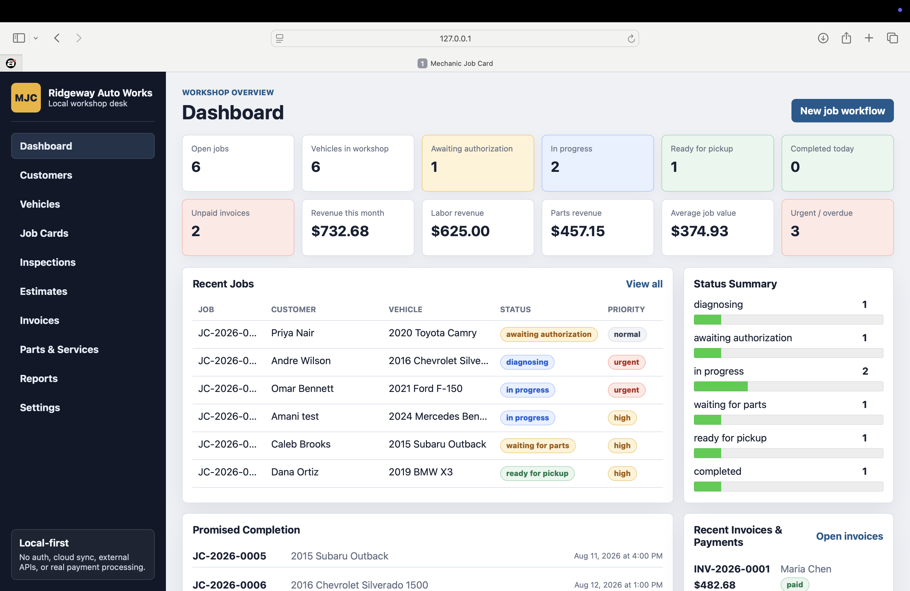
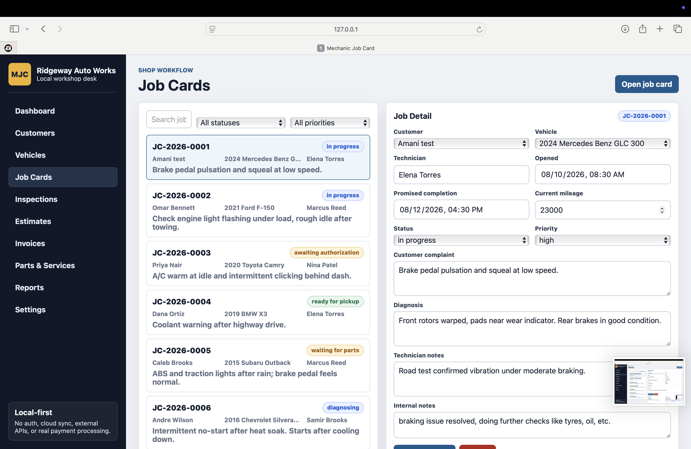
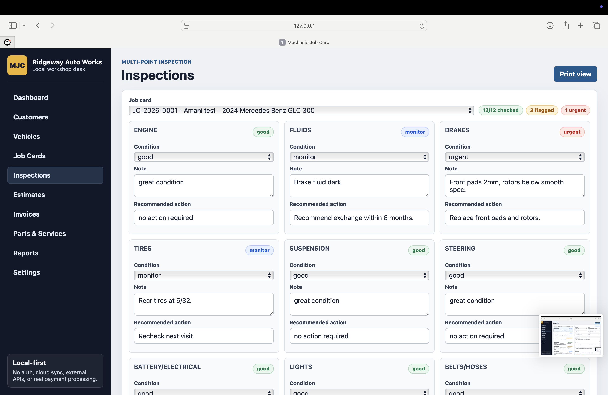
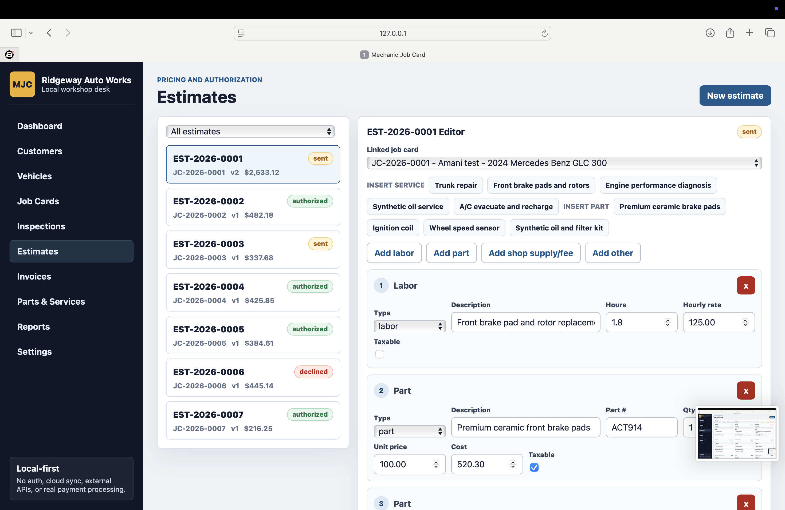
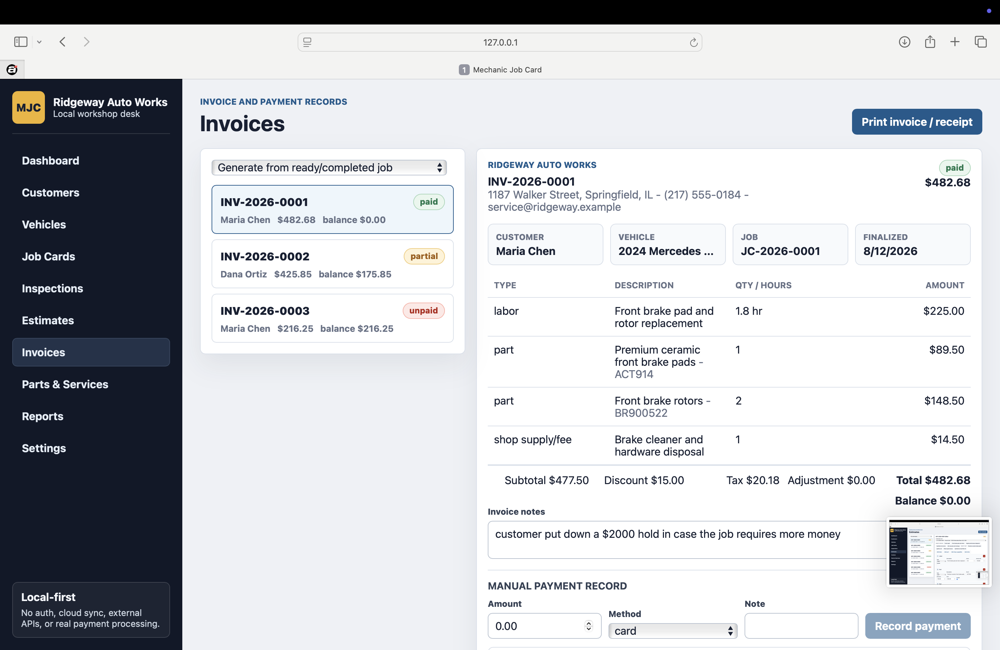
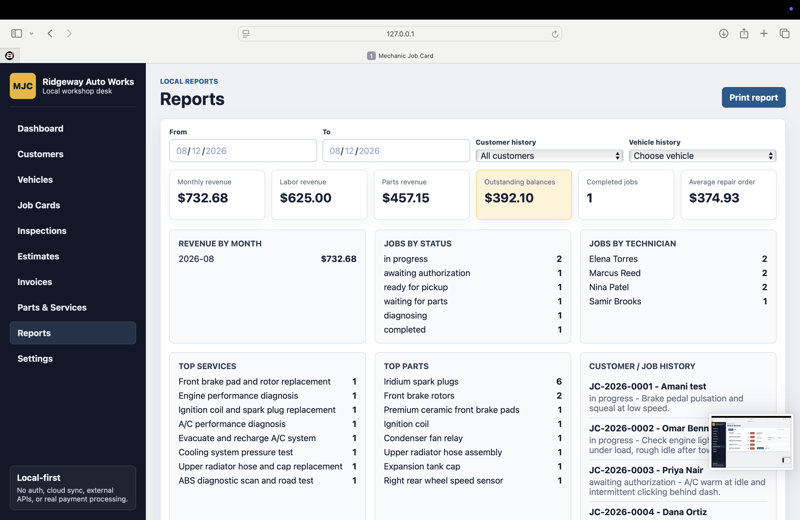

# Mechanic Job Card

**Workshop management software for independent mechanics and small garages.**

Mechanic Job Card is a local-first business application built to organize the full repair workflow in one place:

**Customer → Vehicle → Job Card → Inspection → Estimate → Authorization → Repair Progress → Invoice → Payment Record → Service History**

> This repository is a **public product showcase only**. The commercial application source code is kept private.

## Product Preview

## Screenshots

| Job Cards | Inspections |
| --- | --- |
|  |  |

| Estimates | Invoices |
| --- | --- |
|  |  |

## The Problem

Small repair shops often manage customer details, job cards, inspection notes, estimates, parts, payments, and service history across paper forms, messaging apps, spreadsheets, and memory.

Mechanic Job Card brings those workflows together into one structured workspace designed for day-to-day service operations.

## Core Features

- Customer records with vehicle and service history
- Vehicle management with mileage, VIN/plate search, and repair context
- Job cards with technician assignment, priority, status, diagnosis, and notes
- Multi-point inspections with flagged issues and recommended actions
- Estimates with labor, parts, fees, markup, discounts, tax, and adjustments
- Estimate version history and authorization snapshots
- Printable estimates and invoices
- Invoice generation from completed or ready jobs
- Manual payment records and balance tracking
- Parts and services reference library
- Reporting for revenue, balances, jobs, labor, parts, technicians, and service history
- JSON backup/export and import
- Automated tests around pricing, invoicing, inspections, reports, and persistence

## Designed For

- Independent mechanics
- Small garages
- Auto repair shops
- Mobile mechanics
- Service centers
- Specialty repair businesses

## Technology

The current web product is built with React, Vite, JavaScript, plain CSS, browser localStorage, and testable domain modules.

A separate React Native mobile companion has also been developed for mobile workshop workflows.

## Product Direction

The current version is intentionally local-first. Future commercial additions could include hosted data, authentication, multi-user staff accounts, cloud sync, customer portals, inspection photo attachments, reminders, accounting/payment integrations, and multi-location support.

## Commercial Use

The complete Mechanic Job Card implementation is maintained privately while the product is prepared for commercial licensing and customization.

This repository demonstrates the interface, workflow design, product thinking, and development capabilities without distributing the commercial source code.

## About the Developer

Built by **Amani Robinson**, a React developer focused on business applications, dashboards, workflow tools, CRM-style systems, and operational software.

---

**Mechanic Job Card** — turning scattered workshop processes into one organized repair workflow.

All rights reserved.
